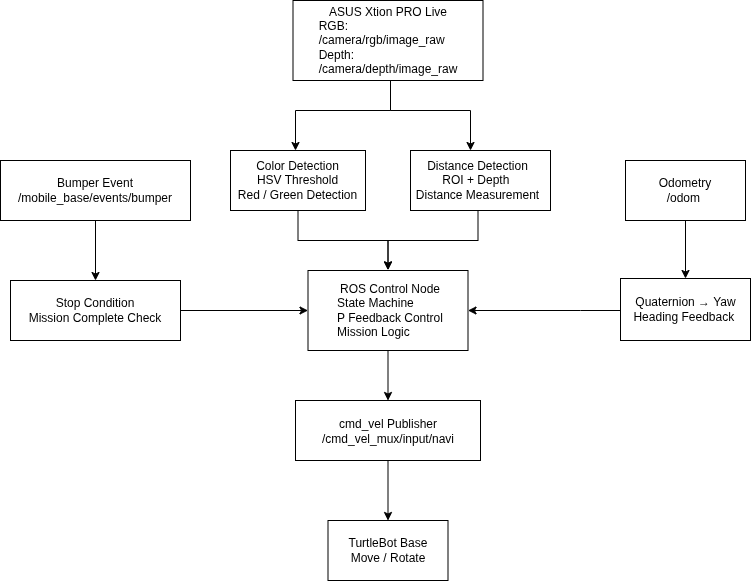
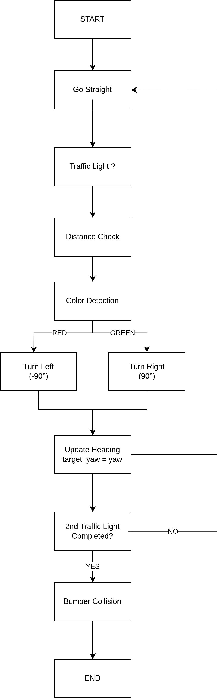

# ROS1 TurtleBot Traffic Light Navigation

## 프로젝트 소개

ROS1 기반 TurtleBot을 이용하여 신호등 인식 및 자율주행 시스템을 구현한 프로젝트입니다.

RGB-D Camera를 이용하여 신호등의 색상과 거리를 인식하고, Odometry 기반 P Feedback Control을 적용하여 Heading Drift를 보정하였습니다.

또한 ROS Publisher / Subscriber 구조와 State Machine 기반 제어를 통해 두 개의 신호등 미션을 수행한 뒤 최종 목적지까지 자율주행하도록 구현하였습니다.

---

# 시스템 구성

---

# 주요 기능

## 1. RGB-D Camera 기반 신호등 인식

- HSV Color Space 기반 빨간색 / 초록색 검출
- Depth Camera ROI 기반 거리 측정
- 일정 거리에서만 색상 인식 수행
- RGB와 Depth 정보를 결합한 신호등 인식

---

## 2. Odometry 기반 직진 제어

- `/odom` Topic을 이용한 현재 Yaw 추정
- Quaternion → Yaw 변환
- 목표 Heading과 현재 Heading 오차 계산
- P Feedback Control을 이용한 Heading Drift 보정

---

## 3. 회전 제어

- 신호등 색상에 따라 ±90° 회전
- 목표 Heading 계산
- Quaternion → Yaw 변환
- 목표 각도 도달 시 정지

---

## 4. State Machine 기반 미션 수행

---

# Demo

**Demo Video**
[Watch on YouTube](https://youtube.com/shorts/DPB7Bxb3I90?feature=share)

---

# ROS Topic 구성

## Subscribe

- `/camera/rgb/image_raw`
- `/camera/depth/image_raw`
- `/odom`
- `/mobile_base/events/bumper`

## Publish

- `/cmd_vel_mux/input/navi`

---

# 사용 기술

- ROS1
- C++
- OpenCV
- cv_bridge
- RGB-D Camera
- HSV Color Detection
- Odometry
- Quaternion to Yaw
- P Feedback Control
- State Machine

---

# 디버깅 및 문제 해결

## 1. 초록색 신호 오인식

**원인**

- 실제 조명 환경에서 기존 HSV Threshold가 맞지 않아 초록색이 빨간색으로 오인식

**해결**

- HSV Threshold 반복 조정
- ROS 로그를 이용한 픽셀 수 확인
- 실제 환경에 맞는 Threshold 재설정

---

## 2. Depth Camera 거리 측정 오류

**원인**

- Depth Camera의 최소 측정 가능 거리로 인해 기존 거리 조건에서 인식이 불가능

**해결**

- 카메라 스펙 확인
- 거리 조건을 65~80cm 범위로 수정하여 안정적인 거리 인식 구현

---

## 3. Heading Drift 발생

**원인**

- Open Loop 방식으로 직진하면서 바닥 마찰 및 휠 오차로 Heading이 점점 틀어짐

**해결**

- Odometry 기반 Yaw 추정
- P Feedback Control 적용
- Angular Velocity 보정을 통해 목표 Heading 유지

---

## 4. 회전 후 Heading 오차

**원인**

- 회전 이후에도 이전 목표 Heading을 계속 사용

**해결**

- 회전 완료 후 현재 Yaw를 새로운 목표 Heading으로 업데이트

---

## 5. 미션 종료 조건 오류

**원인**

- 두 번째 신호등 처리 이후에도 거리 인식 기능이 계속 동작

**해결**

- 두 번째 신호등 미션 완료 후 거리 인식 기능 비활성화

---

## 6. 범퍼 이벤트 처리 오류

**원인**

- 범퍼 이벤트를 항상 감시하도록 구현

**해결**

- 두 개의 신호등 미션 완료 이후에만 범퍼 이벤트 활성화

---

# 프로젝트를 통해 배운 점

- ROS Publisher / Subscriber 기반 노드 구조 이해
- ROS Callback 기반 이벤트 처리
- Quaternion과 Yaw 변환
- OpenCV 기반 영상처리 디버깅
- Odometry 기반 P Feedback Control 구현
- 실제 로봇 환경에서 발생하는 센서 및 하드웨어 오차 분석
- State Machine 기반 자율주행 알고리즘 설계
- 문제 원인 분석과 디버깅을 통한 시스템 개선 경험

---

# 담당 역할

- ROS1 제어 노드 구현
- TurtleBot 자율주행 알고리즘 설계
- Odometry 기반 P Feedback Control 구현
- State Machine 기반 미션 로직 구현
- ROS Publisher / Subscriber 구성
- 영상처리 코드 분석 및 HSV Threshold 튜닝
- 실제 환경에서 시스템 통합 및 디버깅

---

# Project Report

📄 **Project Report**

- `docs/ROS1_TurtleBot_Traffic_Light_Navigation.pdf`
